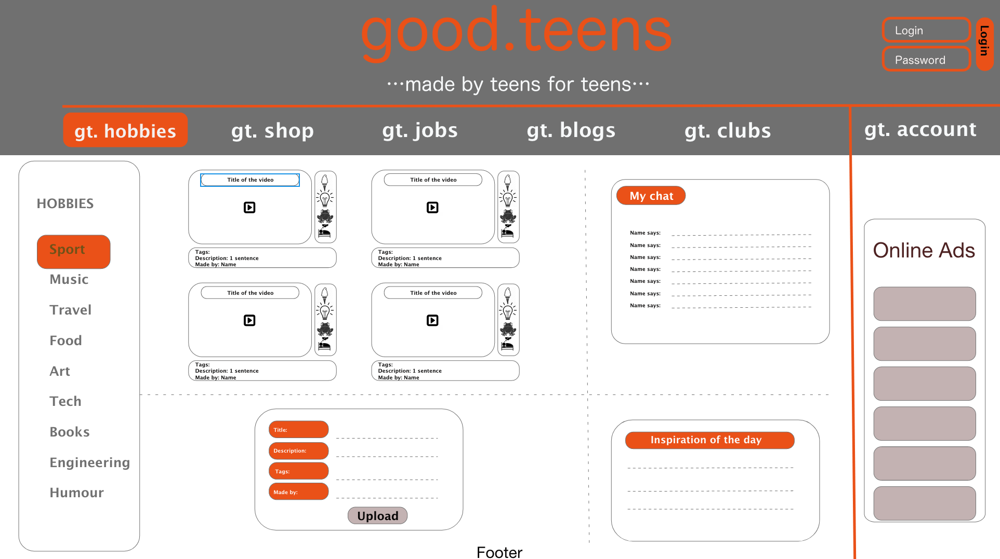

# REDI Sprint 2020 Frontend Development 2, Final Project

Application Name: User account for teenage-content portal

Student Name: Stanka Svecova

Description: A user can register to the portal and access user account with following functionalities: Update & delete personal information Create, post, edit & delete an article Upload a video-link (not the video itself)

## Screenshots

## Features:

    Registration
    User-account: update & delete personal information
    User-account: create, post, edit & delete an article
    Video upload feature (video block feed)
